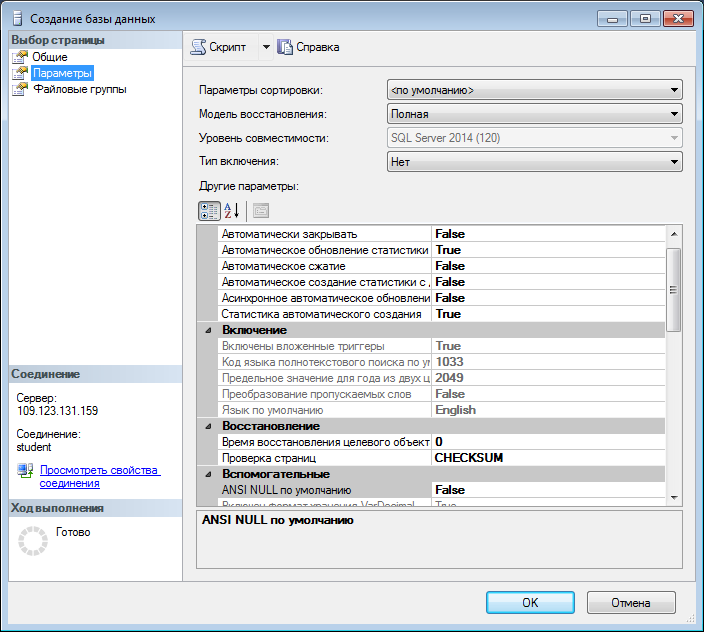
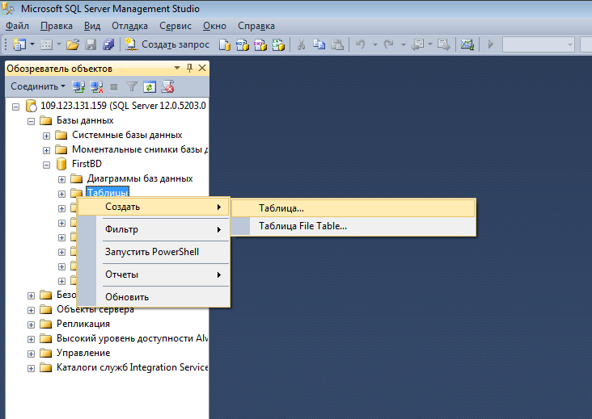
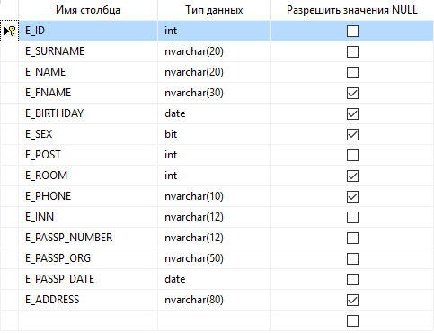
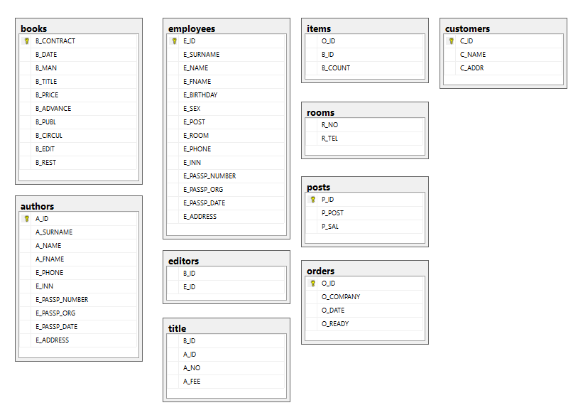

## Знакомство с MS SQL Server. Создание и заполнение таблиц


[все лабораторные](https://github.com/goryachkinama/db-practice/README.md)

---

### Microsoft SQL Server
* Одна из наиболее популярных систем управления базами данных в мире
* Создатель: Microsoft
* Первая версия вышла в 1987 году под Windows
* Начиная с версии #16 система доступна и на Linux (и на Mac, с помощью Docker)
* Текущая версия: ?
* Реляционная модель организации баз данных
---

### Язык SQL

* Разработчик: IBM
* Стандартизован в 1989 году
* Разновидности:
* * PL/SQL (для Oracle Database, но поддерживается также в DB2 и Timesten), 
* * PSQL (Interbase и Firebird) 
* * SQL PL (DB2), 
* * Transact-SQL (Microsoft SQL Server и Adaptive Server Enterprise)
* * PL/pgSQL (PostgreSQL)

```sql
SELECT ProductName,
       Manufacturer,
       Price,
       (SELECT AVG(Price) FROM Products AS SubProds
        WHERE SubProds.Manufacturer=Prods.Manufacturer)  AS AvgPrice
FROM Products AS Prods
WHERE Price >
      (SELECT AVG(Price) FROM Products AS SubProds
       WHERE SubProds.Manufacturer=Prods.Manufacturer)
```
---

### Подмножества языка SQL

DDL (Data Definition Language / Язык определения данных): создание баз данных, таблиц, индексов, хранимых процедур и т.д.
 * CREATE: создает объекты базы данных (саму базу даных, таблицы, индексы и т.д.)
 * ALTER: изменяет объекты базы данных
 * DROP: удаляет объекты базы данных
 * TRUNCATE: удаляет все данные из таблиц
DML (Data Manipulation Language / Язык манипуляции данными): выбор данных, их обновление, добавление, удаление - т.е. управление данными.
 * SELECT: извлекает данные из БД
 * UPDATE: обновляет данные
 * INSERT: добавляет новые данные
 * DELETE: удаляет данные
DCL (Data Control Language / Язык управления доступа к данным). К этому типу относят команды, которые управляют правами по доступу к данным. В частности, это следующие команды:
* GRANT: предоставляет права для доступа к данным
* REVOKE: отзывает права на доступ к данным
---

### SQL Server Management Studio

 • Запустите SQL Server Management Studio.
• В диалоговом окне «Соединение с сервером» подтвердите заданные по умолчанию
  параметры и нажмите кнопку «Подключиться». Для соединения необходимо, чтобы поле «Имя сервера»
  содержало имя компьютера, на котором установлен SQL Server.
  Если компонент Database Engine представляет собой именованный экземпляр, то поле «Имя сервера» должно
  также содержать имя экземпляра в формате <имя_компьютера> \<имя_экземпляра>.
• Ввести имя сервера DBSrv\gor2023 
  MS SQL Server использует два режима аутентификации: Windows и MS SQL Server (SQL Server authentication). 
  По умолчанию используется аутентификация Windows
 

---

### Создание учетной записи

Создайте новую учетную запись с именем STUDENT.

B Management Studio список учетных записей, сконфигурированных на сервере, содержится в папке «\Безопасность\Имена для входа».

1. Чтобы добавить новую учетную запись, необходимо выделить узел  «Имена для входа» в контекстном меню 
   и выбрать пункт «Создать имя для входа…».
2. В открывшемся окне в поле «Имя для входа» введите STUDENT.
3. Выберите переключатель «Проверка подлинности SQL Server» и в поле «Пароль» наберите пароль.
4. Снимите флажок «Пользователь должен сменить пароль при следующем входе».
5. Остальные поля оставьте без изменений.

[add_user](assets/lab0/add_user.png)
---

### Создание базы данных

База данных представляет хранилище объектов. Основные из них:
 
 • Таблицы: хранят собственно данные
 • Представления (Views): выражения языка SQL, которые возвращают набор данных в виде таблицы
 • Хранимые процедуры: выполняют код на языке SQL по отношению к данным к БД (например, получает данные или изменяет их)
 • Функции: также код SQL, который выполняет определенную задачу

В SQL Server используется два типа баз данных: системные и пользовательские. 
 
• Системные базы данных необходимы серверу SQL для корректной работы. 
• Пользовательские базы данных создаются пользователями сервера и могут хранить любую произвольную информацию. 
  Их можно изменять и удалять, создавать заново.

Базу данных может создать только пользователь с правами администратора.

Выберите в контекстном меню папки «Базы данных» команду «Создать базу данных…».
В поле «Имя базы данных» введите имя создаваемой базы данных (БД). «Параметр Владелец» оставьте без изменений


Здесь также можно изменить путь сохранения созданной БД. 
Обратите внимание, что создаётся пустая база данных (контейнер).


В виде таблицы располагаются настройки файла данных и журнала транзакций.

Таблица имеет следующие столбцы:

 • Логическое имя – логическое имя файла данных и журнала транзакций.
   По этим именам будет происходить обращение к вышеприведённым файлам в БД. Можно заметить, что файл данных имеет то 
   же имя что и БД, а имя файла журнала транзакций составлено из имени БД и суффикса «_log».
 
 • Тип файла – этот параметр показывает, является ли файл файлом данных или журналом транзакций.
 • Файловая группа – группа файлов, показывает к какой группе файлов относится файл. Группы файлов настраиваются в группе настроек «Файловая группа».
 • Начальный размер (МБ) – начальный размер файла данных и журнала транзакций в мегабайтах.
 • Авторасширение – как только файл заполняется информацией его размер автоматически увеличивается на величину, указанную в параметре Авторасширение, задаваемое как в мегабайтах так и в процентах. 
   Здесь же можно задать максимальный размер файлов, нажав кнопку «…».
   В нашем случае размер файлов не ограничен. Файл данных увеличивается на 1 мегабайт, а файл журнала транзакций на 10%.
 • Путь – путь к папке, где хранятся файлы. Для изменения этого параметра также надо нажать кнопку «…».
 • Имена файлов – по умолчанию имена файлов аналогичны  логическим именам. Однако файл данных имеет расширение .mdf, 
   а файл журнала транзакций – расширение .ldf. 

Для доступа к другим второстепенным настройкам файла данных необходимо щёлкнуть мышью по пункту «Параметры» в списке «Выбор страницы»:



 • Параметры сортировки – отвечает за обработку текстовых строк, их сравнение, текстовый поиск и т.д. Будет равен значению, заданному на вкладке Параметры сортировки, при установке сервера.
 • Модель восстановления – отвечает за информацию, предназначенную для восстановления БД, хранящуюся в файле транзакций. Чем полнее модель восстановления, тем больше вероятность восстановления данных при сбое системы или ошибках пользователей, 
* * * но и больше размер файла журнала транзакций. При наличии места на диске, рекомендуется оставить этот параметр в значении Простая.
* * • Уровень совместимости – определяет совместимость файла данных с более ранними версиями сервера. 
* * * Если планируется перенос данных на более раннюю версию сервера, то её необходимо указать в этом параметре.
* * • Другие параметры – данные параметры являются необязательными для изменения.
* 
Группа настроек «Файловые группы».


Отвечает за группы файлов, представленые в таблице Строки в правой части окна.
• Имя – имя группы файлов.
• Файлы – количество файлов, входящих в группу.
• Только для чтения – файлы в группе будут только для чтения. То есть, их можно только просматривать, но нельзя изменять.
• По умолчанию – группа по умолчанию. Все новые файлы данных будут входить в эту группу.

В рассматриваемой БД нет необходимости добавлять новые группы файлов.

После создания БД окно «Обозреватель объектов» обновится. В ветке «Базы данных» появится новая база данных
---

### Создание таблиц с помощью мастера

Все таблицы нашей БД находятся в подпапке «Таблицы» папки c именем только что созданной базы данных в окне обозревателя объектов
Создайте новую таблицу, как указано на рисунке. Имя таблицы попросят задать при ее сохрании. 
Для удобства дальнейшей работы с таблицами название рекомендуется записывать латинскими строчными буквами, желательно, на английском. К примеру, таблица сотрудников будет именоваться «employees»



В правой части окна расположена таблица определения полей новой таблицы или атрибутов:


• Имя столбца должно всегда начинаться с буквы и не должно содержать различных специальных символов и знаков препинания.
  Если имя поля содержит пробелы, то оно автоматически заключается в квадратные  скобки, в т.ч. и в дальнейших sql-запросах.
  Рекомендуется записывать название столбцов прописными буквами, добавляя перед названием столбца префикс 
  <первая буква названия таблицы> + _
• [Тип данных столбца](https://metanit.com/sql/sqlserver/3.3.php).
• Разрешить значения Null. Если эта опция поля включена, то в случае не заполнения поля в него будет автоматически подставлено значение Null. То есть, поле необязательно для заполнения.
  
Под таблицей определения полей располагается таблица свойств выделенного поля «Свойства столбца».

Заполненный список столбцов (полей/атрибутов) таблицы будет выглядеть примерно так:



Так как, поле E_ID будет являться первичным полем связи, то лучше сделать его автозаполняемым числовым счётчиком. Более того, оно должно быть ключевым.

Для этого выделите поле, просто щёлкнув по нему мышкой в таблице определения полей. В таблице свойств столбца отобразятся свойства поля E_ID.
Разверните группу свойств «Спецификация идентификатора».
Свойство (Идентификатор) установите в значение «Да».
Задайте свойства «Начальное значение идентификатора» и «Шаг приращения идентификатора» равными 1.


Теперь сделаем поле E_ID ключевым полем.

Выделите поле, а затем на панели инструментов нажмите кнопку с изображением ключа. 
В таблице определения полей, рядом с полем E_ID появится изображение ключа, говорящее о том, что поле ключевое.

Далее при закрытии окна создания новой таблицы либо при нажатии Сохранить появится окно с запросом о сохранении таблицы.
Вводим, к примеру, «employees», в контекстном меню таблиц базы данных жмём «Обновить» - и в обозревателе объектов появится таблица «employees», отображаемая как dbo.employees.
Префикс dbo обозначает, что таблица является объектом базы данных (Data Base Object).
В дальнейшем при работе с объектами базы данных префикс dbo можно опускать.

---

### Связывание таблиц

При работе БД должна обеспечиваться целостность данных. То есть, при удалении записей из первичных таблиц
автоматически должны удаляться связанные с ними записи из вторичных таблиц. 
В случае несоблюдения целостности данных со временем в БД накопится большое количество записей во вторичных таблицах,
связанных с несуществующими записями в первичных таблицах, что приведёт к сбоям в работе БД и её засорению 
неиспользуемыми данными. 
 
Внешний ключ – это столбец (или комбинация столбцов), совпадающий с первичным ключом не которой таблицы.
 
Для обеспечения целостности данных в SQL Server используют диаграммы и триггеры.
Диаграммы – это компоненты БД, которые блокируют удаление записей из первичных таблиц,
если существуют связанные с ними записи во вторичных таблицах. 
 
Для создания новой диаграммы в БД щёлкните правой кнопкой мыши по папке «Диаграммы базы данных»
и в появившемся меню выберем пункт «Новая диаграмма базы данных».


Выберем все таблицы, которые нужны для работы и которые будем связывать друг с другом.



* Теперь необходимо определить связи между таблицами. К примеру, организуем связь между сотрудником и должностью.
* Перед этим уточним, что в случае если мы захотим удалить из БД должность, то необходимо обнулить должность у сотрудника. 
* Для этого необходимо перетащить поле P_ID из таблицы Posts на такое же поле в таблице Employees. 
* 
* Появится окно создания связи между таблицами «Таблицы и столбцы».
* В окне создания связи нажмите кнопку ОК. Появится окно настройки свойств связи «Связь по внешнему ключу».

* Спецификация INSERT и UPDATE определяет, что происходит, если значение первичного ключа, 
* на которое ссылается внешний ключ, удаляется или обновляется:
* * • установить NULL ( SET NULL ) – значение внешнего ключа заменяется NULL-значением. 
* * * Это невозможно, когда внешний ключ является частью первичного ключа своей таблицы. 
* * • установить значение по умолчанию ( SET DEFAULT ) – значение внешнего ключа заменяется значением столбца, 
* * * используемым по умолчанию. 
* * • каскадно ( CASCADE ) – удаляются или обновляются все строки внешнего ключа. 
* * • нет действия ( NO ACTION ) – после обновления нельзя модифицировать значения 
* 
* В диаграмме между таблицами employees и posts появится связь в виде линии.

* Но чтобы увидеть все изменения, не забудьте нажать на «Сохранить» и затем обновить список объектов.
---

[Следующие задания >>>](Lab1.md)

[К списку лабораторных >>>](../README.md)
