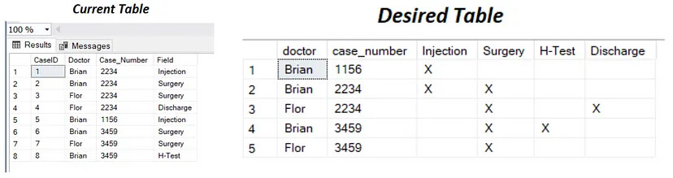

[Таблица академиков](assets/lab2/Академики.xlsx)

[К списку лабораторных >>>](../README.md)

---

### Задание по таблице академиков

1. Вывести список академиков, отсортированный по количеству символов в ФИО.
2. Вывести список академиков, убрать лишние пробелы в ФИО.
3. Найти позиции «ов» в ФИО каждого академика. Вывести ФИО и номер позиции.
4. Вывести ФИО и последние две буквы специализации для каждого академика.
5. Вывести список академиков, ФИО в формате Фамилия и Инициалы.
6. Вывести список специализаций в правильном и обратном виде. Убрать дубликаты.
7. Вывести список академиков, специализацию в CamelCase (переписать с заглавной буквы)
8. Вывести ФИО и первую букву специализации каждого академика (две буквы, если специализация - составное слово)
9. Вывести ФИО и количество полных лет, во сколько академик получил звание
10. Вывести ФИО и високосность года рождения каждого академика.
11. Вывести список академиков, заменить специализации «зоолог» и «ботаник» на «биолог»
12. Вывести список специализаций без повторений. Для каждой специализации вывести «длинный» или «короткий», 
    в зависимости от количества символов.
13. Вывести список всех академиков у которых в фамилии содержатся минимум 2 буквы 'а'
14. Вывести ФИО академиков, которые получили звание раньше, чем его получали в среднем по таблице

---

### Задание по таблице стран

* Разными запросами вычислить средние значения общемировой плотности населения:
*    средняя арифметическая
*    средняя гармоническая
*    средняя геометрическая
*    средняя квадратическая

* То же самое, но по континентам
* ? можно ли посчитать моду и медиану общемировой плотности населения
* ? дисперсию и мат.ожидание общемировой плотности населения

---

### Задания для своих таблиц

* составить 3 запроса с командой select с использование функций cast / convert для преобразования в тип float
* составить 3 запроса на разные форматы дат (с полным названием дня недели) 
* составить 3 запроса на функции проверки значений

* Привести таблицу похожего исходного содержания (создать новую при необходимости) к тоговому виду, как в таблице справа. 
(в примере получается таблица с группировкой по Case_Number и столбцами с именем врача и всеми видами Field,
куда кладутся отметки true/false в зависимости от того, есть ли для врача данное значение в поле Field в исходной таблице)



* На основе таблицы с заполненным столбцом даты одним запросом создать таблицу,
  в которой все три поля даты (год, месяц, день) будут разнесены по разными столбцам. 
  Месяц пишется словом. Поле ИД создается через NEWID() как UNIQUEIDENTIFIER

* Вывести количество дней до конца семестра. 
* Вывести количество месяцев от вашего рождения. 
* Вывести свою фамилию в одной строке столько раз, сколько вам лет. 
* Вывести абсолютное значение функций 𝑠𝑖𝑛^2 ( 𝜋/2 ) − 𝑐𝑜𝑠 ( 3𝜋/2 ) с точностью два знака после десятичной запятой.

---

### [Основные типы данных](https://metanit.com/sql/sqlserver/3.3.php)

Числовые типы данных:
 
* BIT (от 0 до 16). При значениях до 8 (включительно) занимает 1 байт, от 9 до 16 - 2 байта
    Используется как аналог булевого типа (в этом случае значению true соответствует 1, а значению false - 0)

* TINYINT (от 0 до 255). Занимает 1 байт. Хорошо подходит для хранения небольших чисел

* SMALLINT (от -32768 до 32767). Занимает 2 байта

* INT (от -2147483648 до 2147483647). Занимает 4 байта. Наиболее используемый тип для хранения чисел

* BIGINT (от -9223372036854775808 до 9223372036854775807). Занимает 8 байт

* DECIMAL (числа c фиксированной точностью). Занимает от 5 до 17 байт в зависимости от количества чисел после запятой
    Данный тип может принимать два параметра precision и scale: DECIMAL(precision, scale)
    precision: максимальное количество цифр, которые может хранить число (от 1 до 38, по умолчанию 18)
    scale: максимальное количество цифр после запятой (от 0 до значения параметра precision, по умолчанию оно равно 0)

* NUMERIC: (аналогичен типу DECIMAL)

* SMALLMONEY (дробные значения от -214748.3648 до 214748.3647).Занимает 4 байта. Эквивалентен типу DECIMAL(10,4)

* MONEY (дробные значения от -922337203685477.5808 до 922337203685477.5807). Занимает 8 байт. Эквивалентен типу DECIMAL(19,4)

* FLOAT (от -1.79E+308 до 1.79E+308). Занимает от 4 до 8 байт в зависимости от дробной части
    Может иметь форму определения в виде FLOAT(n), где n - число бит, которые используются для хранения десятичной части числа (мантиссы). По умолчанию n = 53

* REAL (числа от –340E+38 до 3.40E+38). Занимает 4 байта. Эквивалентен типу FLOAT(24)

Типы данных, представляющие дату и время:

* DATE (дата от 01/01/0001 до 31/12/9999). Занимает 3 байта

* TIME (время в диапазоне от 00:00:00.0000000 до 23:59:59.9999999). Занимает от 3 до 5 байт
    Может иметь форму TIME(n), где n представляет количество цифр от 0 до 7 в дробной части секунд

* DATETIME (дата и время от 01/01/1753 до 31/12/9999). Занимает 8 байт

* DATETIME2 (дата и время от 01/01/0001 00:00:00.0000000 до 31/12/9999 23:59:59.9999999). Занимает от 6 до 8 байт в зависимости от точности времени
     Может иметь форму DATETIME2(n), где n представляет количество цифр от 0 до 7 в дробной части секунд
* SMALLDATETIME (дата и время от 01/01/1900 до 06/06/2079). Занимает от 4 байта.

* DATETIMEOFFSET (дата и время от 01/01/0001 до 31/12/9999). Занимает 10 байт. Сохраняет детальную информацию о времени с точностью до 100 наносекунд

Распространенные форматы дат:

* yyyy-mm-dd - 2017-07-12
* dd/mm/yyyy - 12/07/2017
* Month dd, yyyy - July 12, 2017
* mm-dd-yy - 07-12-17 В таком формате двузначные числа от 00 до 49 воспринимаются как даты в диапазоне 2000-2049. 
  А числа от 50 до 99 как диапазон чисел 1950 - 1999.

Распространенные форматы времени:

* hh:mi - 13:21
* hh:mi am/pm - 1:21 pm
* hh:mi:ss - 1:21:34
* hh:mi:ss:mmm - 1:21:34:12
* hh:mi:ss:nnnnnnn - 1:21:34:1234567

Строковые типы данных:

* CHAR (фиксированная строка длиной от 1 до 8000 символов). На каждый символ выделяет по 1 байту. Не подходит для многих языков, так как хранит символы не в кодировке Unicode.
    Количество символов, которое может хранить столбец, передается в скобках. Например, для столбца с типом CHAR(10) будет выделено 10 байт.
    И если мы сохраним в столбце строку менее 10 символов, то она будет дополнена пробелами.
 
* VARCHAR (переменная строка длиной от 1 до 8000 символов). На каждый символ выделяет по 1 байту.
    Можно указать конкретную длину для столбца - от 1 до 8 000 символов, например, VARCHAR(10).
    Если строка должна иметь больше 8000 символов, то задается размер MAX, а на хранение строки может выделяться до 2 Гб: VARCHAR(MAX).
    Не подходит для многих языков, так как хранит символы не в кодировке Unicode.
    В отличие от типа CHAR если в столбец с типом VARCHAR(10) будет сохранена строка в 5 символов, то в столце будет сохранено именно пять символов.
 
* NCHAR (Unicode – фиксированная строка длиной от 1 до 4000 символов). На каждый символ выделяется 2 байта. Например, NCHAR(15)
 
* NVARCHAR (Unicode – переменная строка длиной от 1 до 4000 символов). На каждый символ выделяется 2 байта.
    Можно задать конкретный размер от 1 до 4 000 символов. Если строка должна иметь больше 4000 символов, то задается размер MAX, а на хранение строки может выделяться до 2 Гб.
 
* TEXT и NTEXT (устаревшие, не рекомендуется использовать)
  
Бинарные типы данных:

* BINARY (фиксированные бинарные данные от 1 до 8000 байт)
* VARBINARY (переменные бинарные данные от 1 до 8000 байт)
* IMAGE (устаревшая, не рекомендуется использовать)

Другие типы данных:

* UNIQUEIDENTIFIER (уникальный идентификатор GUID). Занимает 16 байт
* TIMESTAMP (номер версии строки в таблице). Занимает 8 байт
* CURSOR (набор строк таблицы)
* HIERARCHYID (позиция в иерархии)
* SQL_VARIANT (данные любого типа)
* XML (документы или фрагменты XML). Занимает в памяти до 2 Гб
* TABLE (определение таблицы)
* GEOGRAPHY (географические данные, такие как широта и долгота)
* GEOMETRY (координаты на плоскости)

---

### Встроенные функции Transact-SQL

Функции SQL производят действия с данными и возвращают результат.

Встроенные функции делятся на три основные группы:
* скалярные функции – обрабатывают одиночное значение и возвращают одно значение. Их можно использовать везде, где допускается применение выражений.
* агрегатные функции – используются для получения обобщающих значений. Они, в отличие от скалярных функций, оперируют значениями столбцов множества строк;
* функции для списка значений.

Скалярные функции бывают следующих категорий:

* строковые функции – выполняют определенные действия над строками и возвращают строковые или числовые значения;
* числовые функции – возвращают числовые значения на основании заданных в аргументе значений того же типа;
* функции времени и даты – выполняют различные действия над входными значениямивремени и даты и возвращают строковое, числовое значение или значение в формате даты и времени;
* функции преобразования типа

---

### [Функции для работы со строками](https://metanit.com/sql/sqlserver/8.1.php)

Для работы со строками в T-SQL можно применять следующие функции:

* LEN(строка): возвращает количество символов в строке. В качестве параметра в функцию передается строка, для которой надо найти длину:
```sql
SELECT LEN('Apple')  -- 5
```

* TRIM(строка), TRIM(\[символ FROM] строка): удаляет символ пробела или другие заданные символы в начале и в конце строки.

* LTRIM: удаляет начальные пробелы из строки:
```sql
SELECT LTRIM('  Apple')
```

* RTRIM(строка): удаляет конечные пробелы из строки:
```sql
SELECT RTRIM(' Apple    ')
```

* CHARINDEX(подстрока, строка, начальная позиция): возвращает индекс, по которому находится первое вхождение подстроки в строке. 
  В качестве первого параметра передается подстрока, а в качестве второго - строка, в которой надо вести поиск,
  в качестве необязательного третьего - начальная позиция:
```sql
SELECT CHARINDEX('pl', 'Apple') -- 3
```

* PATINDEX('%шаблон%', строка): возвращает индекс, по которому находится первое вхождение определенного шаблона в строке:
```sql
SELECT PATINDEX('%p_e%', 'Apple')   -- 3
```

* LEFT(строка, число): вырезает с начала строки определенное количество символов. Первый параметр функции - строка, 
  а второй - количество символов, которые надо вырезать сначала строки:
```sql
SELECT LEFT('Apple', 3) -- App
```

* RIGHT(строка, число): вырезает с конца строки определенное количество символов. Первый параметр функции - строка, 
  а второй - количество символов, которые надо вырезать сначала строки:
```sql
SELECT RIGHT('Apple', 3)    -- ple
```

* SUBSTRING(строка, начальная позиция, длина): вырезает из строки подстроку определенной длиной, начиная с определенного индекса. 
  Певый параметр функции - строка, второй - начальный индекс для вырезки, и третий параметр - количество вырезаемых символов:
```sql
SELECT SUBSTRING('Galaxy S8 Plus', 8, 2)    -- S8
```

* REPLACE(строка, подстрока, замена): заменяет одну подстроку другой в рамках строки. Первый параметр функции - строка, 
  второй - подстрока, которую надо заменить, а третий - подстрока, на которую надо заменить:
```sql
SELECT REPLACE('Galaxy S8 Plus', 'S8 Plus', 'Note 8')   -- Galaxy Note 8
```

* REVERSE(строка): переворачивает строку наоборот:
```sql
SELECT REVERSE('123456789') -- 987654321
```

* CONCAT(строка1, строка2 [, строкаN ] ): объединяет две строки в одну. 
  В качестве параметра принимает от 2-х и более строк, которые надо соединить:
```sql
SELECT CONCAT('Tom', ' ', 'Smith')  -- Tom Smith
```

* LOWER(строка): переводит строку в нижний регистр:
```sql
SELECT LOWER('Apple')   -- apple
```

* UPPER(строка): переводит строку в верхний регистр
```sql
SELECT UPPER('Apple')   -- APPLE
```

* SPACE(число): возвращает строку, которая содержит определенное количество пробелов

* REPLICATE(строка, число): повторяет значение строки указанное число раз

* STUFF(строка, начальная позиция, количество, замена) удаляет указанное количество символов первой строки
  в начальной позиции и вставляет на их место замену.

---

### [Функции для работы с числами](https://metanit.com/sql/sqlserver/8.2.php)

* ROUND(число, точность): округляет число. В качестве первого параметра передается число. 
  Второй параметр указывает на длину. 
  Если длина представляет положительное число, то оно указывает, до какой цифры после запятой идет округление. 
  Если длина представляет отрицательное число, то оно указывает, до какой цифры с конца числа до запятой идет округление
```sql
SELECT ROUND(1342.345, 2)   -- 1342.350
SELECT ROUND(1342.345, -2)  -- 1300.000
```

* ISNUMERIC: определяет, является ли значение числом. В качестве параметра функция принимает выражение. 
  Если выражение является числом, то функция возвращает 1. Если не является, то возвращается 0.
```sql
SELECT ISNUMERIC(1342.345)          -- 1
SELECT ISNUMERIC('1342.345')        -- 1
SELECT ISNUMERIC('SQL')         -- 0
SELECT ISNUMERIC('13-04-2017')  -- 0
```

* ABS(число): возвращает абсолютное значение числа.
```sql
SELECT ABS(-123)    -- 123
```

* POWER(число, степень): возвращает значение указанного выражения, возведенное в заданную степень

* CEILING(число): возвращает наименьшее целое число, которое больше или равно текущему значению.
```sql
SELECT CEILING(-123.45)     -- -123
SELECT CEILING(123.45)      -- 124
```

* FLOOR(число): возвращает наибольшее целое число, которое меньше или равно текущему значению.
```sql
SELECT FLOOR(-123.45)       -- -124
SELECT FLOOR(123.45)        -- 123
```

* SIGN(число) возвращает положительное (+1), нулевое (0) или отрицательное (-1) значение, обозначающее знак заданного выражения

* SQUARE(число): возводит число в квадрат.
```sql
SELECT SQUARE(5)        -- 25
```

* SQRT(число): получает квадратный корень числа.
```sql
SELECT SQRT(225)        -- 15
```

* PI() возвращает константное значение π

* RAND(\[начальное значение]): генерирует случайное число с плавающей точкой в диапазоне от 0 до 1.
```sql
SELECT RAND()       -- 0.707365088352935
SELECT RAND()       -- 0.173808327956812
```

* COS(число): возвращает косинус угла, выраженного в радианах
```sql
SELECT COS(1.0472)  -- 0.5 - 60 градусов
```

* SIN(число): возвращает синус угла, выраженного в радианах
```sql
SELECT SIN(1.5708)  -- 1 - 90 градусов
```

* TAN(число): возвращает тангенс угла, выраженного в радианах
```sql
SELECT TAN(0.7854)  -- 1 - 45 градусов
```

* COT(число) возвращает котангенс указанного угла в радианах

* ACOS(число) возвращает угол в радианах, косинус которого задан – арккосинус.
* ASIN(число) возвращает угол в радианах, синус которого задан – арксинус.
* ATAN(число) возвращает угол в радианах, тангенс которого задан – арктангенс.

* DEGREES(число) возвращает для значения угла в радианах соответствующее значение в градусах.
* RADIANS(число) возвращает для значения угла в градусах соответствующее значение в радианах

* EXP(число) возвращает экспонент заданного числа
* LOG(число) возвращает натуральный логарифм указанного числа
* LOG(число, основа) возвращает логарифм указанного числа
* LOG10(число) возвращает десятичный логарифм указанного числа

---

### [Функции для работы с датами и временем](https://metanit.com/sql/sqlserver/8.3.php)

* GETDATE(): возвращает текущую локальную дату и время на основе системных часов в виде объекта datetime
```sql
SELECT GETDATE()    -- 2017-07-28 21:34:55.830
```

* CURRENT_TIMEZONE() возвращает имя часового пояса

* GETUTCDATE(): возвращает текущую локальную дату и время по гринвичу (UTC/GMT) в виде объекта datetime
```sql
SELECT GETUTCDATE()     -- 2017-07-28 18:34:55.830
```

* SYSDATETIME(): возвращает текущую локальную дату и время на основе системных часов, 
  но отличие от GETDATE состоит в том, что дата и время возвращаются в виде объекта datetime2
```sql
SELECT SYSDATETIME()        -- 2017-07-28 21:02:22.7446744
```

```sql
ALTER TABLE Employees ADD CONSTRAINT DF_Employees_HireDate DEFAULT SYSDATETIME() FOR HireDate
```

* SYSUTCDATETIME(): возвращает текущую локальную дату и время по гринвичу (UTC/GMT) в виде объекта datetime2
```sql
SELECT SYSUTCDATETIME()     -- 2017-07-28 18:20:27.5202777
```

* SYSDATETIMEOFFSET(): возвращает объект datetimeoffset(7), который содержит дату и время относительно GMT
```sql
SELECT SYSDATETIMEOFFSET()      -- 2017-07-28 21:02:22.7446744 +03:00
```

* DAY(дата): возвращает день даты, который передается в качестве параметра
```sql
SELECT DAY(GETDATE())       -- 28
```

* MONTH(дата): возвращает месяц даты
```sql
SELECT MONTH(GETDATE())     -- 7
```

* YEAR(дата): возвращает год из даты
```sql
SELECT YEAR(GETDATE())      -- 2017
```

* DATENAME(параметра выбора, дата): возвращает часть даты в виде строки. 
  Параметр выбора части даты передается в качестве первого параметра, а сама дата передается в качестве второго параметра:
```sql
SELECT DATENAME(month, GETDATE())       -- July
```

Для определения части даты можно использовать следующие параметры (в скобках указаны их сокращенные версии):

year (yy, yyyy): год
quarter (qq, q): квартал
month (mm, m): месяц
dayofyear (dy, y): день года
day (dd, d): день месяца
week (wk, ww): неделя
weekday (dw): день недели
hour (hh): час
minute (mi, n): минута
second (ss, s): секунда
millisecond (ms): миллисекунда
microsecond (mcs): микросекунда
nanosecond (ns): наносекунда
tzoffset (tz): смешение в минутах относительно гринвича (для объекта datetimeoffset)

* DATEPART(параметра выбора, дата): возвращает часть даты в виде числа. Параметр выбора части даты передается 
  в качестве первого параметра (используются те же параметры, что и для DATENAME), 
  а сама дата передается в качестве второго параметра:
```sql
SELECT DATEPART(month, GETDATE())       -- 7
```

* DATEADD: возвращает дату, которая является результатом сложения числа к определенному компоненту даты.
  Первый параметр представляет компонент даты, описанный выше для функции DATENAME. 
  Второй параметр - добавляемое количество. Третий параметр - сама дата, к которой надо сделать прибавление:
```sql
SELECT DATEADD(month, 2, '2017-7-28')       -- 2017-09-28 00:00:00.000
SELECT DATEADD(day, 5, '2017-7-28')     -- 2017-08-02 00:00:00.000
SELECT DATEADD(day, -5, '2017-7-28')        -- 2017-07-23 00:00:00.000
```

Если добавляемое количество представляет отрицательное число, то фактически происходит уменьшение даты.

* DATEDIFF: возвращает разницу между двумя датами. 
  Первый параметр - компонент даты, который указывает, в каких единицах стоит измерять разницу. 
  Второй и третий параметры - сравниваемые даты:
```sql
SELECT DATEDIFF(year, '2017-7-28', '2018-9-28')     -- разница 1 год
SELECT DATEDIFF(month, '2017-7-28', '2018-9-28')    -- разница 14 месяцев
SELECT DATEDIFF(day, '2017-7-28', '2018-9-28')      -- разница 427 дней
```

* TODATETIMEOFFSET: возвращает значение datetimeoffset, которое является результатом сложения временного смещения с объектом datetime2
```sql
SELECT TODATETIMEOFFSET('2017-7-28 01:10:22', '+03:00')
```

* SWITCHOFFSET: возвращает значение datetimeoffset, которое является результатом сложения временного смещения с другим объектом datetimeoffset
```sql
SELECT SWITCHOFFSET(SYSDATETIMEOFFSET(), '+02:30')
```

* EOMONTH: возвращает дату последнего дня для месяца, который используется в переданной в качестве параметра дате.
```sql
SELECT EOMONTH('2017-02-05')    -- 2017-02-28
SELECT EOMONTH('2017-02-05', 3) -- 2017-05-31
```
В качестве необязательного второго параметра можно передавать количество месяцев, которые необходимо прибавить к дате. 
Тогда последний день месяца будет вычисляться для новой даты.

* DATEFROMPARTS: по году, месяцу и дню создает дату
```sql
SELECT DATEFROMPARTS(2017, 7, 28)       -- 2017-07-28
```

* ISDATE: проверяет, является ли выражение датой. Если является, то возвращает 1, иначе возвращает 0.
```sql
SELECT ISDATE('2017-07-28')     -- 1
SELECT ISDATE('2017-28-07')     -- 0
SELECT ISDATE('28-07-2017')     -- 0
SELECT ISDATE('SQL')            -- 0
```

В качестве примера использования функций можно привести создание таблицы заказов, которая содержит дату заказа:
```sql
CREATE TABLE Orders
(
Id INT IDENTITY PRIMARY KEY,
ProductId INT NOT NULL,
CustomerId INT NOT NULL,
CreatedAt DATE NOT NULL DEFAULT GETDATE(),
ProductCount INT DEFAULT 1,
Price MONEY NOT NULL
);
```
Выражение DEFAULT GETDATE() указывает, что если при добавлении данных не передается дата, 
то она автоматически вычисляется с помощью функции GETDATE().

Другой пример - найдем заказы, которые были сделаны 16 дней назад:

```sql
SELECT * FROM Orders
WHERE DATEDIFF(day, CreatedAt, GETDATE()) = 16
```

---

### [Функции преобразования данных](https://metanit.com/sql/sqlserver/8.4.php)

* CAST(выражение AS тип) преобразуют выражение в заданный тип
* CONVERT(тип, выражение \[, стиль])
* ASCII(строка) возвращает код ASCII первого символа указанного символьного выражения
* UNICODE(строка) возвращает код Юникод первого символа указанного символьного выражения
* CHAR(число) возвращает символ ASCII с указанным кодом
* NCHAR(число) возвращает символ Юникода с указанным кодом
* STR(число) возвращает символьные данные, преобразованные из числовых данных

Также:

*	TRY_CAST
*	TRY_CONVERT
*	PARSE
*	TRY_PARSE


---

### Функции проверки значений

* ISDATE(выражение) возвращает 1, если выражение имеет допустимое значение типа даты и времени, иначе возвращает значение 0
* ISNUMERIC(выражение) возвращает 1, если выражение имеет допустимое значение числовой тип данных, иначе возвращает 0
* ISNULL(выражение, замена) заменяет значение NULL указанным замещающим значением
* COALESCE(выражение\[,...n ]) вычисляет аргументы по порядку и возвращает текущее значение первого выражения, 
  изначально не вычисленного как NULL.

---

### Логические функции

Логические функции позволяют выполнять логические операции. 
Иными словами, это что-то вроде условных конструкций, реализованных в виде функций.

*	IIF (о ней сказано ниже в отдельном блоке)
*	CHOOSE

---

### Функции работы с курсорами

Такие функции возвращают сведения о курсорах, которым будет отведена отдельная лабораторная.
Все функции работы с курсорами являются недетерминированными.

*	@@CURSOR_ROWS
*	@@FETCH_STATUS
*	CURSOR_STATUS

---

### Функции JSON

Такие функции предназначены для работы с форматом данных JSON.
*	ISJSON
*	JSON_VALUE
*	JSON_QUERY
*	JSON_MODIFY

---

### Ранжирующие функции

Ранжирующие функции возвращают ранжирующее значение для каждой строки в секции набора данных. 
В зависимости от используемой функции значения некоторых строк могут совпадать. 
Ранжирующие функции являются недетерминированными.

*	ROW_NUMBER
* RANK
*	DENSE_RANK
*	NTILE

---

### Аналитические функции

Аналитические функции вычисляют статистическое значение на основе группы строк. 
Такие функции можно использовать для вычисления скользящих средних, 
промежуточных итогов, процентных долей, первых или последних строк в группе.

* FIRST_VALUE
*	LAST_VALUE
*	LAG
*	LEAD
*	PERCENT_RANK
*	PERCENTILE_CONT
*	PERCENTILE_DISC
*	CUME_DIST

---

### Функции конфигурации

Функции, которые возвращают сведения о текущих значениях параметров конфигурации.
Все функции конфигурации являются недетерминированными.

*	@@DATEFIRST
*	@@DBTS
*	@@LANGID
*	@@LANGUAGE
*	@@LOCK_TIMEOUT
*	@@MAX_CONNECTIONS
*	@@MAX_PRECISION
*	@@NESTLEVEL
*	@@OPTIONS
*	@@REMSERVER
*	@@SERVERNAME
*	@@SERVICENAME
*	@@SPID
*	@@TEXTSIZE
*	@@VERSION

---

### Функции метаданных

Функции, которые возвращают сведения о базах данных и объектах баз данных. 
Все функции метаданных являются недетерминированными.

*	VERSION
*	DB_ID
*	DB_NAME
*	FILE_ID
*	FILE_NAME
*	APP_NAME
*	OBJECT_ID
*	OBJECT_NAME
*	SCHEMA_ID
*	SCHEMA_NAME
*	SCOPE_IDENTITY
*	TYPE_ID
*	TYPE_NAME
*	PARSENAME
*	SERVERPROPERTY
*	и другие.

---

### Функции безопасности
Функции, которые возвращают данные о пользователях и ролях. 
Иными словами, такие функции возвращают сведения, необходимые для управления безопасностью.

*	IS_MEMBER
*	IS_ROLEMEMBER
*	IS_SRVROLEMEMBER
*	SUSER_SNAME
*	SYSTEM_USER
*	SUSER_NAME
*	USER_ID
*	USER_NAME
*	SUSER_SID
*	SESSION_USER
*	CURRENT_USER
*	и другие.

---

### Системные функции

Функции, которые выполняют операции над значениями, объектами и параметрами экземпляра Microsoft SQL Server и возвращают сведения о них.

---

### Системные статистические функции

Такие функции возвращают статистические сведения о системе. Все системные статистические функции являются недетерминированными.

*	@@CONNECTIONS
*	@@PACK_RECEIVED
*	@@CPU_BUSY
*	@@PACK_SENT
*	fn_virtualfilestats
*	@@TIMETICKS
*	@@IDLE
*	@@TOTAL_ERRORS
*	@@IO_BUSY
*	@@TOTAL_READ
*	@@PACKET_ERRORS
*	@@TOTAL_WRITE

---

### [CASE и IIF](https://metanit.com/sql/sqlserver/8.5.php)

Особое место среди встроенных скалярных функций языка SQL занимают функции вывода, 
которые являются разновидностью CASE-выражений. Функция CASE проверяет значение некоторого выражения, 
и в зависимости от результата проверки может возвращать тот или иной результат.

Выражение CASE имеет два формата:
 
* простое выражение CASE для определения результата сравнивает выражение с набором простых выражений;
* поисковое выражение CASE для определения результата вычисляет набор логических выражений.

CASE принимает следующую форму:

```sql
CASE выражение
WHEN значение_1 THEN результат_1
WHEN значение_2 THEN результат_2
.................................
WHEN значение_N THEN результат_N
[ELSE альтернативный_результат]
END
```

Также функция CASE может принимать еще одну форму:

```sql
CASE
WHEN выражение_1 THEN результат_1
WHEN выражение_2 THEN результат_2
.................................
WHEN выражение_N THEN результат_N
[ELSE альтернативный_результат]
END
```

Оба формата поддерживают дополнительный аргумент ELSE.

Функция IIF(условие, выражение_если_истина, выражение_если_ложь) – возвращает одно из двух значений
в зависимости от того, принимает логическое выражение значение true или false.

```sql
IIF(условие, значение_1, значение_2)
```

Если условие в функции IIF истинно то возвращается значение_1, если ложно, то возвращается значение_2. Например:

```sql
SELECT ProductName, Manufacturer,
IIF(ProductCount>3, 'Много товара', 'Мало товара')
FROM Products
```

---

### [Функция NEWID](https://metanit.com/sql/sqlserver/8.6.php)

Для генерации объекта UNIQUEIDENTIFIER, то есть некоторого уникального значения, используется функция NEWID(). 
Например, мы можем определить для столбца первичного ключа тип UNIQUEIDENTIFIER 
и по умолчанию присваивать ему значение функции NEWID:

```sql
CREATE TABLE Clients
(
Id UNIQUEIDENTIFIER PRIMARY KEY DEFAULT NEWID(),
FirstName NVARCHAR(20) NOT NULL,
LastName NVARCHAR(20) NOT NULL,
Phone NVARCHAR(20) NULL,
Email NVARCHAR(20) NULL
)

INSERT INTO Clients (FirstName, LastName, Phone, Email)
VALUES ('Tom', 'Smith', '+36436734', NULL),
('Bob', 'Simpson', NULL, NULL)
```

---

### Примеры

Вывести абсолютное значение тригонометрических функций на точке π:
```sql
SELECT
ABS(COS(PI())) AS Косинус_Пи
,ABS(SIN(PI())) AS Синус_Пи
,ABS(TAN(PI())) AS Тангенс_Пи
,ABS(COT(PI())) AS КоТангенс_Пи
```

Вывести день, месяц, год, час, минуту, секунду, номер квартала, номер недели, день года, день недели для текущей даты и времени:
```sql
SELECT
DAY(GETDATE()) AS День
,MONTH(GETDATE()) AS Месяц
,YEAR(GETDATE()) AS Год
,DATEPART(HOUR, GETDATE()) AS Час
,DATEPART(MINUTE, GETDATE()) AS Минута
,DATEPART(SECOND, GETDATE()) AS Секунда
,DATEPART(QUARTER, GETDATE()) AS Квартал
,DATEPART(WEEK, GETDATE()) AS Неделя
,DATEPART(DAYOFYEAR, GETDATE()) AS День_года
,DATEPART(WEEKDAY, GETDATE()) AS День_недели
```

Вывести ФИО и время года рождения каждого академика:
```sql
SELECT
ФИО
, CASE MONTH(Дата_рождения)
WHEN 3 THEN 'Весна'
WHEN 4 THEN 'Весна'
WHEN 5 THEN 'Весна'
WHEN 6 THEN 'Лето'
WHEN 7 THEN 'Лето'
WHEN 8 THEN 'Лето'
WHEN 9 THEN 'Осень'
WHEN 10 THEN 'Осень'
WHEN 11 THEN 'Осень'
ELSE 'Зима'
END AS Времени_года
FROM Академики
```

---


